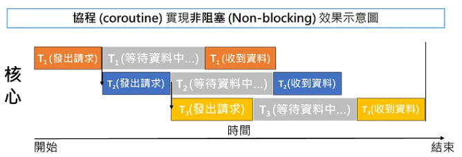
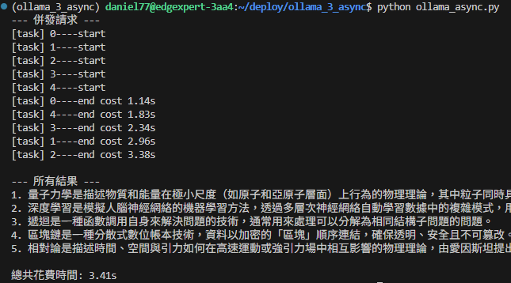
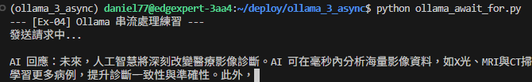

# 我的AI技能 - async / concurrency 篇


## > 階段一：基礎非同步+併發實作 [async_concurrency](./ollama_async_concurrency.py)
- 使用 async 、 await 並用 asyncio.run() 做入口、asyncio.gather()做併發。
```bash
uv add ollama
```
- 環境建置： 學習如何安裝並使用非同步版本的 Client 端庫（如 ollama.AsyncClient）。
- 定義協程 (Coroutine)： 使用 async def 定義一個封裝 Ollama 請求的函式，並理解 await 的放置位置。
- 單一非同步呼叫： 練習在不阻塞主線程的情況下，發送一次請求並獲取結果。
- 使用```from ollama import AsyncClient```套件。
```python
await AsyncClient().generate(model='qwen3:4b-instruct', prompt=prompt, stream=True)
```
### > 非同步+併發 使總花費時間更短
### 一般:
- 
### 非同步:
- 
### 非同步併發
- 


### > 什麼時候適合用async?
- I/O Bound : 網路請求、檔案讀寫等，發出請求CPU就可以做其他事情。

### > 什麼時候"不"適合用async?
- 輕量級的邏輯 : 簡單運算，沒必要。
- CPU Bound : 大量計算，CPU全卡在這個任務(function)上，無法處理其他任務

---

## > 階段二：基礎串流處理實作 [ollama_async_for](./ollama_async_for.py)
- 使用async、await for 和 stream=True、 flush=True

- 使用```from ollama import AsyncClient```套件。
```python
async for part in await AsyncClient().generate(model='qwen3:4b-instruct', prompt=prompt, stream=True):
    content = part['response']
```
- 說明:
    - async for: 迭代非同步生成器。
    - await: 等待非同步生成器完成。
    - stream=True: 啟用串流模式，讓模型在生成時逐塊回傳結果。
    - flush=True: 確保每次輸出後立即將內容顯示在終端機上，而不是等待緩衝區滿。
    
    - 