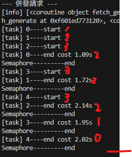
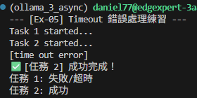
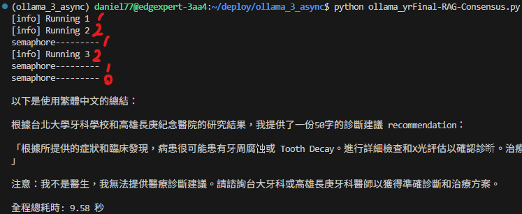

# 我的AI技能 - async / concurrency 篇

## > 前置:
```bash
ollama serve
ollama pull {model}
```
### ```from ollama import AsyncClient```套件需要先pull。

---

## > 階段一：基礎非同步+併發實作 [async_concurrency](./ollama_async_concurrency.py)
- 使用 async 、 await 並用 asyncio.run() 做入口、asyncio.gather()做併發。
- await 放在等那行做完才繼續的地方。

```bash
uv add ollama
```
- 環境建置： 學習如何安裝並使用非同步版本的 Client 端庫（如 ollama.AsyncClient）。
- 定義協程 (Coroutine)： 使用 async def 定義一個封裝 Ollama 請求的函式，並理解 await 的放置位置。
- 單一非同步呼叫： 練習在不阻塞主線程的情況下，發送一次請求並獲取結果。
- 使用```from ollama import AsyncClient```套件。
```python
response = await AsyncClient().generate(model='qwen3:4b-instruct', prompt=prompt, stream=True)
```
### > 非同步+併發 使總花費時間更短
### 一般:
- 
### 非同步:
- 
### 非同步併發
- 


### > 什麼時候適合用async?
- I/O Bound : 網路請求、檔案讀寫等，發出請求CPU就可以做其他事情。

### > 什麼時候"不"適合用async?
- 輕量級的邏輯 : 簡單運算，沒必要。
- CPU Bound : 大量計算，CPU全卡在這個任務(function)上，無法處理其他任務

---

## > 階段二：基礎串流處理實作 [ollama_async_for](./ollama_async_for.py)
- 使用```async```、```await for``` 和 ```stream=True```、 ```flush=True```

- 使用```from ollama import AsyncClient```套件。
```python
async for part in await AsyncClient().generate(model='qwen3:4b-instruct', prompt=prompt, stream=True):
    content = part['response']
```
- 說明:
    - async for: 迭代非同步生成器。
    - await: 等待非同步生成器完成。
    - stream=True: 啟用串流模式，讓模型在生成時逐塊回傳結果。
    - flush=True: 確保每次輸出後立即將內容顯示在終端機上，而不是等待緩衝區滿。
    
    - 

## > 階段三 : Semaphore 限制併發數量 [ollama_semaphore](./ollama_semaphore.py)
- 使用```asyncio.Semaphore()```配合```async with```限制併發數量。

- 使用```from ollama import AsyncClient```套件。
```python
SEMAPHORE = asyncio.Semaphore(3)

async def fetch_generate(prompt:str, task_id:int):
    #semaphore控制一次最多3個任務同時執行
    async with SEMAPHORE:
        ...
        return ...
```
### 說明:
- async with SEMAPHORE: 進入這個區塊前，必須先取得一個許可證，如果許可證不夠，就必須等待，直到有其他任務釋放許可證。

### > 什麼時候適合用Semaphore?
- 當你想要限制併發數量時，例如：
    - API Rate Limit：限制同時呼叫外部 API 的數量。
    - 資源控制：限制同時存取有限資源（如資料庫連線、記憶體）的數量。
    - 負載平衡：避免瞬間湧入大量請求導致系統崩潰。

### 非同步併發+Semaphore



## > 階段四 : 限制併發數量 [ollama_wait_for](./ollama_wait_for.py)
- 使用```asyncio.wait_for()```超時產生```asyncio.TimeoutError```。

- 使用```from ollama import AsyncClient```套件。
```python
response = await asyncio.wait_for(
    AsyncClient().generate(model='qwen3:4b-instruct', prompt=prompt),
    timeout=timeout_limit
)
```

- 正常情況： 如果任務在指定時間內完成，它會回傳結果。
- 超時情況： 如果超過時間，它會直接中斷該任務並拋出 asyncio.TimeoutError。
- 重點： 當超時發生時，被中斷的任務通常會被「取消（Cancel）」，這能有效釋放被占用的系統資源。




---

## > 階段五 : 綜合應用 [ollama_Final-RAG-Consensus](./ollama_yrFinal-RAG-Consensus.py)

### 實作場景：AI 多元投票與檢索系統
-- 情境描述： 你手上有一個使用者的醫學提問。為了確保準確，系統需要：
- 同時檢索 兩個不同的知識來源（模擬 I/O 延遲）。
- 並發呼叫 兩個不同的 AI 模型（例如 llama3 與 qwen3）進行分析。
- 限制資源：由於顯存有限，最多只能同時有 2 個 AI 任務。
- 超時保護：任何檢索或推論超過 10 秒即視為失效。
- 串流顯示：最終的彙整回應要用串流顯示給使用者。

#### 這個題目將會把 並發（Concurrency）、限流（Semaphore）、串流（Streaming） 與 安全（Timeout） 全部揉合進一個模擬的 RAG（檢索增強生成） 工作流中。

### hint
- 同時檢索兩個不同的知識來源 : ```await asyncio.gather```兩個mock_rag。
- 並發呼叫兩個不同的 AI 模型 : ```await asyncio.gather```打兩個帶model變數的function。
- 限制資源 : ```asyncio.Semaphore```和```async with SEMAPHORE```
- 超時保護：
```pyhon
response = await asyncio.wait_for(
    AsyncClient().generate(model,prompt),
    timeout = TIMEOUT
)
```
- 串流顯示 : ```flush=True```和```Stream=True```
```python
async for msg in await AsyncClient().generate(model=llama3,prompt=merged_response,stream=True)
        print(msg, end="", flush=Ture)
```
### > 實作結果輸出
