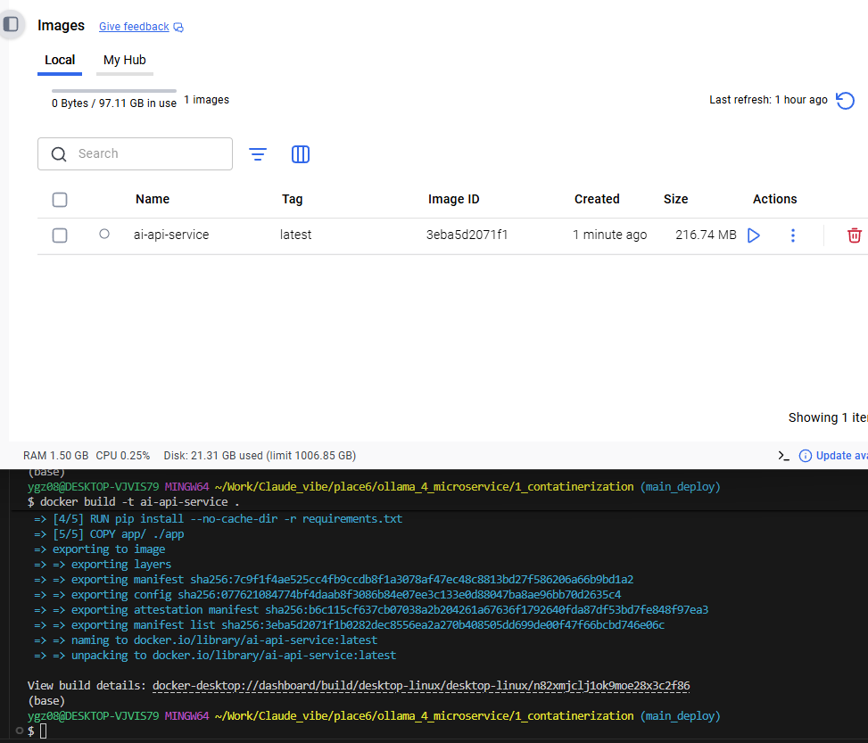
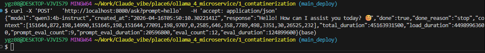

### 先確保ollama本地起著
```bash
ollama serve
```


### 建立映像檔 (Build)
```bash
docker build -t ai-api-service .
```



### 啟動容器 (Run)
```bash
docker run -d \
  --name my-ai-container \
  -p 8080:8000 \
  --add-host=host.docker.internal:host-gateway \
  ai-api-service
```

### 測試你的微服務
```bash
curl -X 'POST' \
  'http://localhost:8080/ask?prompt=hello' \
  -H 'accept: application/json'
```
