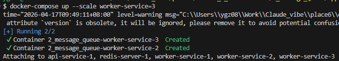
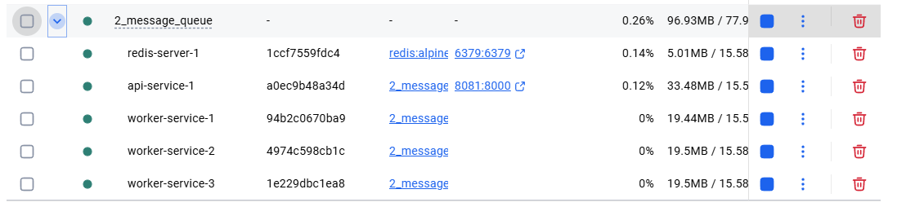
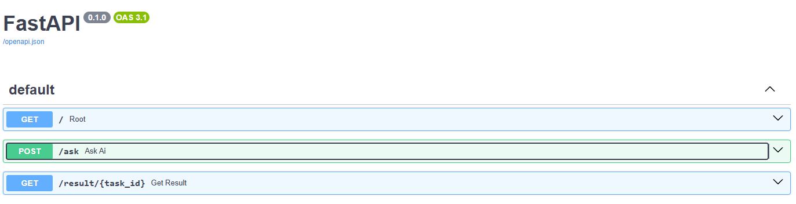

## 練習目標:
- 併發能力：現在你可以同時發送 10 個請求，API 不會掛掉，它們會乖乖在 Redis 裡排隊。
- 水平擴展 (Scaling)：如果任務太多處理不完，你只需要執行 docker-compose up --scale worker-service=3，系統就會多出 3 個工兵同時處理隊列中的 AI 任務。
    - ```bash
      docker-compose up --scale worker-service=3
      ```
    - 
    - 
- 容錯性：即便 worker-service 暫時當機，使用者的請求依然會安全地存放在 Redis 中，等 Worker 重啟後就會繼續處理。


## 先確保ollama本地起著
```bash
ollama serve
```

## 啟動容器 (Run)
```bash
docker-compose up --build
```

FastAPI Swagger UI: http://localhost:8081/docs#/



---

## 核心:


### 1. 用```uuid```產生任務ID和```r.lpush```推入redis
```python 
    task_id = str(uuid.uuid4())  # 生成唯一的任務 ID
    task_data = {"task_id": task_id, "prompt": prompt}

    # 將任務推入名為 'ai_tasks' 的隊列中
    r.lpush("ai_tasks", json.dumps(task_data))
```

### 2. 用```r.brpop```從redis取出任務
```python
while True:
    _, task_json = r.brpop("ai_tasks")
    task = json.loads(task_json)
```

### 3.執行完後用```r.setex```將結果存回redis。

```python
r.setex(f"result:{task_id}", 3600, answer) # 3600秒後自動刪除
```

### 4.用```r.get```從redis取出結果
```python
result = r.get(f"result:{task_id}")
```

---

### 測試結果

- 使用/ask
```
> 早安

{
  "status": "Task queued",
  "task_id": "fd6a0d52-a1bd-487b-a0c4-d1ff6aa50640"
}
```

- 使用 /result/{task_id}

```
{
  "task_id": "fd6a0d52-a1bd-487b-a0c4-d1ff6aa50640",
  "answer": "早安！🌞  \n希望你今天充满能量，心情愉快，每天都像清晨的阳光一样明亮温暖～  \n有什么想聊的、想做的，或者需要帮忙的，随时告诉我哦！😊"
}
```