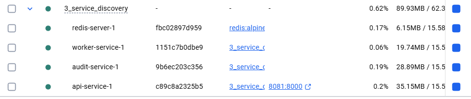
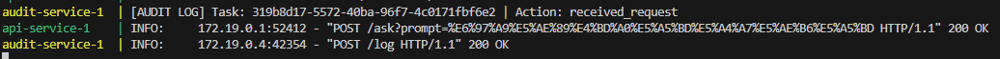
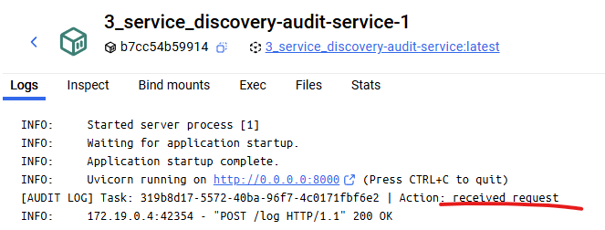
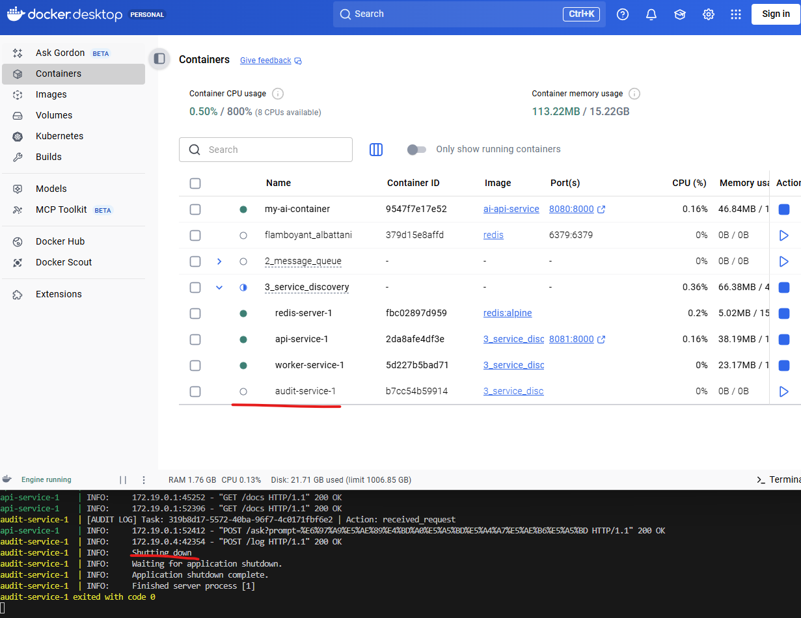
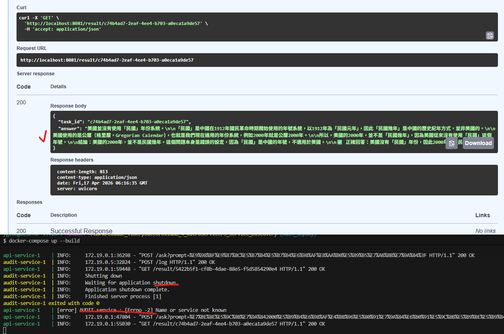

# 服務發現與通訊

### 第三階段：服務發現與通訊 [Service Discovery and Communication](./STEP.md)

- 使用AUDIT_SERVICE_URL = "http://audit-service:8000/log" 來進行服務發現
    - 練習使用容器名稱進行通訊
    - 練習使用斷路器(Circuit Breaker)來處理依賴服務失效


## 架構
```bash
ollama-microservice/
├── app/
│   ├── main.py
│   ├── worker.py
│   └── requirements.txt
├── audit/
│   ├── audit_log.py
│   ├── requirements.txt
│   └── Dockerfile         <-- Audit 專用的打包檔
├── Dockerfile             <-- API/Worker 共用的打包檔
└── docker-compose.yml
```

## code
```bash
docker-compose up --build
```




## 核心
- ### audit-service 

    - ### 執行/ask時，audit容器 收到 Action: received_request
    - 
    - 

- ### 停掉audit容器
    - ### 「處理服務失敗」（例如 Audit Service 掛掉時 API 不該跟著掛掉）的斷路器 (Circuit Breaker)
    - 

    - ### 且繼續打 /ask + /result/{task_id} 都可以正常使用
    - 


---
# 問題與細節:

## 為神麼audit被打POST就可以自動拿到資料?

Pydantic 是核心：你的 LogEntry 繼承自 BaseModel。這讓它不只是一個資料容器，還具備了強大的驗證功能。

程式碼中：
```python
await Client.post(..., json={"task_id": "...", "action": "..."}) 
```
發送了 JSON。
```python
class LogEntry(BaseModel):
    task_id: str
    action: str

@app.post("/log")
async def record_log(entry: LogEntry): 
    ...
```
FastAPI 看到 entry: LogEntry，就把這個 JSON 對應（Map）到了 entry 這個變數上。

所以，你不需要 get，因為在 record_log 函式被執行的一瞬間，資料已經被 FastAPI 整理好並塞進 entry 裡面等你了。這就是為什麼 FastAPI 寫起來非常簡潔的原因！


## 同步與異步

- 如果你在同步函數中（例如：```def main():```），你必須使用 ```httpx.Client()```。在同步環境下強行跑異步程式碼會非常麻煩。

- 如果你在異步函數中（例如：```async def root():```），建議改用 ```with httpx.AsyncClient() as client:```。

## 同步 vs. 異步的差別
- ```httpx.Client() (同步)：```

    - 行為：發出請求後，程式碼會「停在那裡」等伺服器回傳，這叫 Blocking（阻塞）。

    - 情境：如果你的程式一次只處理一個任務（**例如從 Queue 拿一個任務、處理、結束**），同步寫法簡單且穩定。

- ```httpx.AsyncClient() (異步)：```

    - 行為：發出請求後，程式碼會暫時交出控制權，去處理別的事。

    - 情境：如果你需要**同時對 10 個 API 發請求**，或者你的 FastAPI 服務需要處理極高的併發量，這才顯現出優勢。