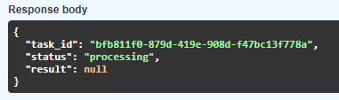
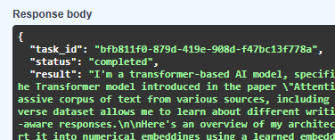

#  升級 : 4_Persistence
1. ## 任務需求 (Functional Requirements)

- ### 非同步進度查詢：修改 GET /result/{task_id}，除了回傳結果，還要能顯示任務狀態（例如：Pending 在排隊中、Processing 處理中、Completed 已完成）。
    - /ask -> 
    ```python
    r.setex(f"status:{task_id}", 3600, "waiting")
    ```

    - worker.py -> 
    ```python
    r.setex(f"status:{task_id}", 3600, "processing")
    r.setex(f"result:{task_id}", 3600, answer)
    r.setex(f"status:{task_id}", 3600, "completed")
    ```

    - /result/{task_id} -> 
    ```python
    r.get(f"status:{task_id}")
    ```




- ### Audit 服務降級 (Degradation)：當你手動關閉 audit-service 時，api-service 絕對不能回傳 500 錯誤，必須能正常發放 task_id 並在 Log 中警告 Audit 服務失聯。
    - /ask -> 
    ```python
    try: 
        await Clinet.post(AUDIT_SERVICE_URL, json={"task_id": task_id, "action": "received_request"},) 
    except Exception as e: 
        print(f"[error] Audit Service down. {e}")
    ```

- ### 多模型切換：在 POST /ask 時，允許使用者指定 model 參數（例如：llama3 或 phi3）。如果指定的模型不在 Ollama 中，Worker 必須能回傳明確的錯誤訊息給 Redis。
    - /ask -> 
    ```python
    r.lpush(
        "ai_tasks", json.dumps({"task_id": task_id, "prompt": prompt, "model": model})
    )
    ```
    - worker.py -> 
    ```python
    with httpx.Client() as client:
        payload = {
            "model": model,
            "prompt": prompt,
            "stream": False,
        }
        response = client.post(url=ollama_url, json=payload, timeout=120.0)
        answer = response.json().get("response", "error")

    ```
# 完成

## 完成這三個測試後，你就從「會寫 API」進階到「會設計分散式系統」了。學會了：

- ### Stateful API：透過 Redis 管理任務生命週期。
    - waiting
    - processing
    - completed
    - error

- ### Resilience：主動處理依賴服務失效。
    - ```audit-service down```
    - ```ollama down```

- ### Elasticity：透過增加容器數量來對抗運算量。
    - ```docker-compose up --scale worker-service=3 -d```