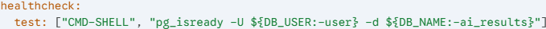
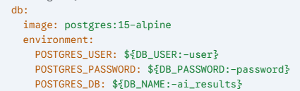
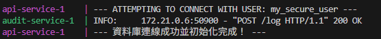
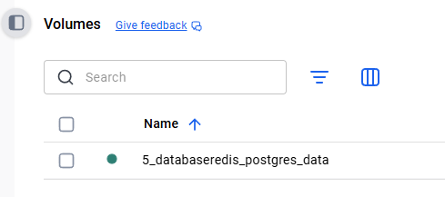
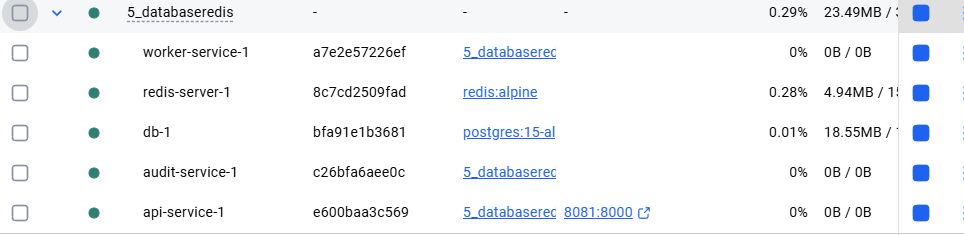
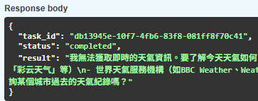

#  升級 : 5_Database&redis

延續4_Persistence:

1. 新增postgresql在app/database.py。

2. 修正docker-compose.yml，新增postgresql和redis的volume。
    - db內新增health check : 確認postgresql是否正常運作。
    - 
    - 新增.env檔案，設定postgresql的密碼。
    - 

```python
    engine = create_engine(SQLALCHEMY_DATABASE_URL)
    SessionLocal = sessionmaker(autocommit=False, autoflush=False, bind=engine)
    Base = declarative_base()
```

3. 在worker接到redis任務後，先將任務寫入postgresql，再更新redis。 
    -避免redis斷線導致任務丟失
    - 

```python
# postgresql
    db = SessionLocal()
    db.add(
        AIResult(task_id=task_id, prompt=prompt, model=model, answer=answer)
    )
    db.commit()
    db.close()
```

4. 修改/result/{task_id}，優先查詢database，如果沒有再查詢redis。
    - 資料持久化 : 即使你執行 docker-compose down 把所有容器刪掉，只要 postgres_data 這個 volume 還在，重開後資料不會消失。
    - ```python
        @app.get("/result/{task_id}")
        async def get_result(task_id: str):
            ...
        ```
    - 

5. 新增db初始化的重試機制
    - 避免db還沒啟動就開始執行，導致失敗。
    - worker也新增restart: always。

## 說明:

### 快取與儲存的分離 (Cache vs. Storage)：

- Redis：當作「快取」和「消息隊列」，處理的是暫時性、高頻率的資料（例如：任務排隊、當前狀態）。
- PostgreSQL：當作「真理來源 (Source of Truth)」，處理的是永久性、結構化的資料（例如：對話歷史、使用者偏好）。

### 任務持久化 (Task Persistence)：

- 確保即使 Redis 重啟或清空，正在執行的任務也不會遺失，因為它們已經被寫入 PostgreSQL。


## code

1. API 層：把任務丟進 Redis ai_tasks，並立刻回傳 task_id 給前端。

2. Worker 層：

    - 從 Redis 拿任務。
    - 把「處理中」狀態寫入 Redis（讓前端能即時看到進度）。
    - 跑 AI。
    - 存入 DB（永久保存）。
    - 更新 Redis（快速取用）。


## 運行
```bash
docker-compose up --build
```


- 確保每次build前都清掉:```docker-compose down -v```


正常 : 
```http://localhost:8081/docs#/```

