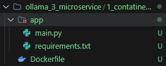

# 我的AI技能 - microservice 篇

## 簡介 : 分散式管理系統

### 分散了以下四個維度：

1. 分散「運算壓力」 (Compute Decoupling)

    這是最直覺的部分。AI 推論是非常吃資源的（CPU/GPU）。
    - 傳統做法：API 接收請求後，立刻在同一個程式裡跑 AI。如果同時有 10 個人問問題，API 會直接卡死，連基本的網頁都打不開。

    - 分散式做法：API 只負責「收單」（把任務丟進 Redis），真正耗體力的 AI 運算交給後端的 worker-service。效果：你可以把 API 放在一台便宜的伺服器上，把 worker-service 放在一台裝有強大顯示卡的伺服器上。

2. 分散「時間依賴」 (Temporal Decoupling)

    這是透過 Redis 隊列 實現的。
    - 傳統做法：請求與回應是同步的（Synchronous）。使用者必須開著視窗等 30 秒，中間網路斷掉就前功盡棄。

    - 分散式做法：請求是非同步的（Asynchronous）。使用者發送完立刻拿到 ID 就可以先去喝咖啡。系統在後台「慢慢處理」，處理完再把結果存起來。效果：系統的「反應速度」變得極快（因為 API 只負責收單），而「處理能力」則根據後台進度調整。

3. 分散「故障風險」 (Fault Isolation)

    這就是你之前觀察到 audit-service 斷線的實驗。
    - 傳統做法：日誌功能模組寫在主程式裡，如果日誌模組因為磁碟滿了而崩潰，整個主程式都會當機。

    - 分散式做法：日誌是一個獨立的容器。效果：即使 Audit 壞了、或是 Ollama 服務重啟，你的 api-service (對外的門面) 依然是綠燈，使用者依然可以正常下單。這就是**「局部失效不等於全局崩潰」**。

4. 分散「技術棧與環境」 (Environment Isolation)

    透過 Dockerfile 實現。
    - 傳統做法：你必須在伺服器上安裝 Python 3.10、特定版本的 PyTorch、Redis 驅動...。不同功能可能需要不同版本的套件，這會引發環境衝突。
    
    - 分散式做法：每個服務都有自己的 requirements.txt 和作業系統鏡像。效果：audit-service 可以用極簡的 Python 環境，而 worker-service 可以用包含 NVIDIA 驅動的大型環境，彼此互不干擾。

---

### 總結：分散式的本質這套系統的分散式架構可以總結為下表：

| 分散了什麼 | 核心組件 |解決了什麼問題  |
|-------------------|----------------|----------|
| 工作載荷    | Worker Service | 避免主服務被 AI 運算拖垮  |
| 等待時間    | Redis Queue | 使用者不需要原地等待耗時任務 |
| 錯誤影響    | Docker Containers | 單一功能故障不會導致全系統癱瘓 |
| 版本依賴    | Dockerfile | 讓不同功能可以使用最適合自己的軟體環境 |

---

## 開始練習

### > 基本架構:


### > 套件
```python
from fastapi import FastAPI
import httpx
```

使用docker build、docker run、curl 測試


---

### 第一階段：容器化 [Containerization](C:\Users\ygz08\Work\Claude_vibe\place6\ollama_4_microservice\1_contatinerization\STEP.md)
微服務的基礎是容器。首先，練習將你的 API 程式碼撰寫成 Dockerfile。

練習建立一個簡單的 FastAPI 環境。

練習如何透過 docker-compose.yml 將 API 服務與 Ollama 連接起來（即便 Ollama 在宿主機執行）。

---

### 第二階段：異步解耦 [Decoupling](C:\Users\ygz08\Work\Claude_vibe\place6\ollama_4_microservice\2_Message_Queue\STEP.md)
這是微服務最關鍵的一環。AI 推論通常很慢，不應該讓使用者在 HTTP 請求上死等。

引進消息隊列 (Message Queue)： 練習使用 Redis 或 RabbitMQ。

流程： 1. 使用者發送請求到 API。
2. API 將任務丟入 Redis 隊列後立即回傳「任務 ID」。
3. Worker 服務從 Redis 抓取任務，呼叫 Ollama API，完成後將結果存入資料庫。

---

### 第三階段：服務發現與通訊 [Service Discovery and Communication](C:\Users\ygz08\Work\Claude_vibe\place6\ollama_4_microservice\3_Service_Discovery\STEP.md)
練習使用 HTTP 內網通訊：讓 API 服務透過容器名稱（如 http://ollama-worker:8000）而非 IP 地址與其他服務溝通。

---

### 第四階段：建立一個「強韌的 AI 影像/文字摘要流水線」(實作在[README.md](./4_Persistence/README.md))
這個題目要求你優化目前的架構，模擬一個真實生產環境中會遇到的極端情況。

1. 任務需求 (Functional Requirements)

    非同步進度查詢：修改 GET /result/{task_id}，除了回傳結果，還要能顯示任務狀態（例如：Pending 在排隊中、Processing 處理中、Completed 已完成）。

    Audit 服務降級 (Degradation)：當你手動關閉 audit-service 時，api-service 絕對不能回傳 500 錯誤，必須能正常發放 task_id 並在 Log 中警告 Audit 服務失聯。

    多模型切換：在 POST /ask 時，允許使用者指定 model 參數（llama3 和 qwen3）。如果指定的模型不在 Ollama 中，Worker 必須能回傳明確的錯誤訊息給 Redis。

2. 核心技術挑戰 (Technical Challenges)

    實作「心跳監測」 (Health Checks)
    在 docker-compose.yml 中為 ollama 或 worker-service 加入 healthcheck 指令。練習讓 API 服務在發送任務前，先確認後端的 Worker 是否處於健康狀態。如果 Worker 全掛了，API 應直接告知使用者「系統繁忙中」。

    壓力測試與動態擴展 (Horizontal Scaling)
    同時發送 20 個複雜的 AI 請求。

觀察單一 Worker 處理的速度（你會發現 Redis 堆積了很多任務）。

執行指令：```docker-compose up --scale worker-service=3 -d```。

觀察日誌，看看三個 Worker 是否開始同時從 Redis 搶任務執行，處理速度是否提升了 3 倍。

---

### 第五階段：結果持久化 [Persistence](./5_Database&redis/README.md)
目前你的結果存在 Redis（重啟會消失）。系統中加入一個 Database 服務  PostgreSQL。

- Worker 處理完後，將結果寫入資料庫。

- API 服務優先從資料庫讀取，找不到再從 Redis 讀。

### 為什麼這個題目適合當結尾？
這個實作能讓你深刻體會到微服務最迷人的地方：系統不再是一個整塊，而是一個有生命的生態系。

- 學到：如何處理「網路是不穩定的」這個事實。

- 體會到：為什麼需要 Redis。當 Worker 被你手動停掉、升級、或擴展時，使用者的請求依然安全的待在隊列裡，沒有遺失。

- 掌握：如何透過增加容器數量（Scale out）來解決運算力不足的問題，而不需要改動任何一行程式碼。