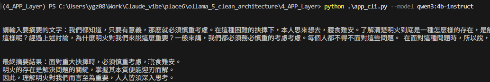
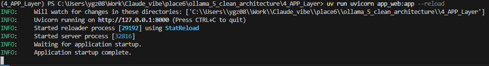
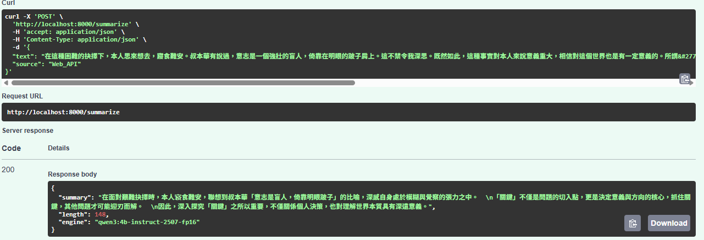
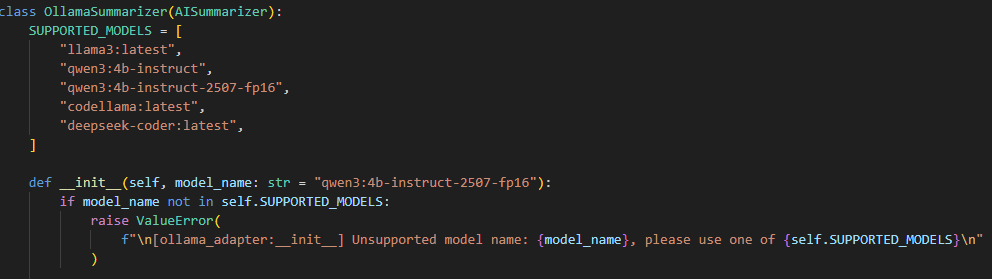
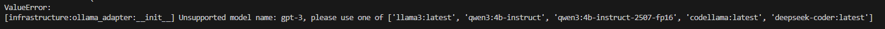
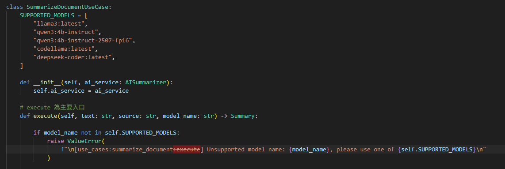

# App Layer  | 應用端實作

## 實作 :
```python
project_root/
├── domain/             # (1) 規則層：純資料、純介面 (Entities/Interfaces)
├── use_cases/          # (2) 邏輯層：流程編排 (指揮官)
├── infrastructure/     # (3) 工具層：Ollama API 實作 (工人)
├── app_cli.py          # (4) 進入點 A
└── app_web.py          # (4) 進入點 B
```

---

1. CLI 端入口

- 
- 

---

2. FastAPI 端入口

```bash
uv run uvicorn app_web:app --reload
```

- 

- 網址：```http://localhost:8000/docs#/```

- 

---

## 新增:


- 為了避免使用者輸入不支援的模型，需要製作白名單，<font color="pink">本文選擇在infrastructure層做白名單檢查。</font>

### -> <font color="orange">若在infrastructure層做白名單檢查，代表是每一個`Summarizer`都有自己的白名單，`OllamaSummarizer`只支援某些模型，`OpenAISummarizer`只支援某些模型。</font>

在 `infrastructure/ollama_adapter.py` 中新增了 `SUPPORTED_MODELS` 列表，並在 `__init__` 方法中進行檢查。
- 

- 

### -> <font color="orange">若在use case層做白名單檢查，代表是是業務決定根據成本考量，所以選擇只支援這些模型，程式方面也不用根據每個service去實作白名單，但要改到底層的interfaces.py。</font>

- 

- 新增model_name參數


