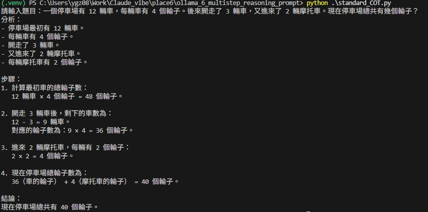
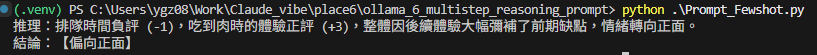
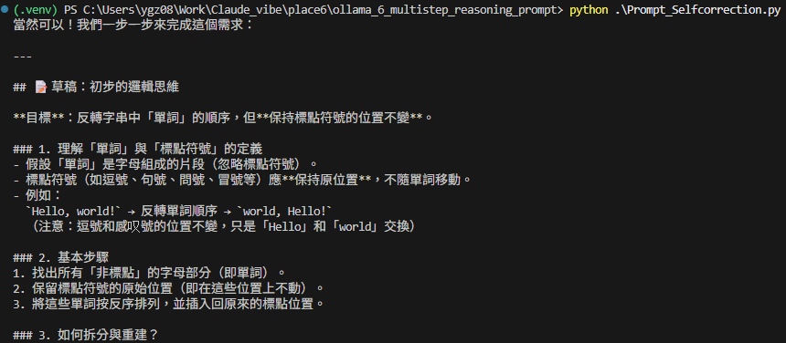

# 我的AI技能 - COT 篇

## 1. Standard CoT

```python
prompt=
"""
    請遵循以下格式回答：

    分析：列出題目給的所有已知數據。

    步驟：逐步計算數量的變化。

    結論：給出最終答案。    
    """
```



## 2 Few-shot

```python
prompt="""
        我要你判斷一段話的情緒，並解釋原因。
        範例 1：
        用戶：『這部電影特效很好，但劇情簡直是災難。』
        推理：特效正評 (+1)，劇情負評 (-2)，整體偏向負面。
        結論：【偏向負面】

        範例 2：
        用戶：『這家餐廳排隊排很久，但吃到第一口肉時我覺得一切都值得了。』
        推理：[請依照範例 1 的邏輯補完推理過程]
        結論：
    """
```




## 3 Self-Correction

```python
prompt="""
        請寫一段 Python 程式碼來反轉字串中的單詞順序，但保持標點符號位置不變。

        要求：

        草稿：先寫出初步的邏輯思維。

        檢查：檢查這個邏輯是否處理了多個標點符號相連的情況？是否有邊界案例（Edge cases）？

        優化：基於檢查結果，寫出最終的程式碼。
    """
```


