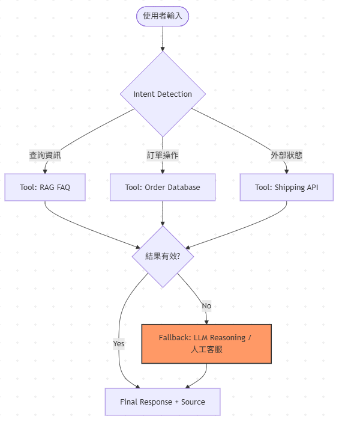

```python
#使用者用str輸入
str(user) -> LLM(intent 計算 >0.6) -> JSON(Tool_FQA/Tool_DB)
                            <0.6  ->  JSON(Tool_LLM)

str(user) -> Tool_FQA(RAG計算similarity)-> >0.6 -> str(回覆QA) -> end。
                                        <0.6 -> str("查無相關資訊") -> 人工 -> end。

str(user) -> Tool_DB(SQL計算) -> exsist -> item(回覆SQL結果) -> end
                               not exsist -> str("查無相關資訊") -> 人工 -> end。

str(user) -> Tool_LLM(str) -> str(回覆) -> end。
```





